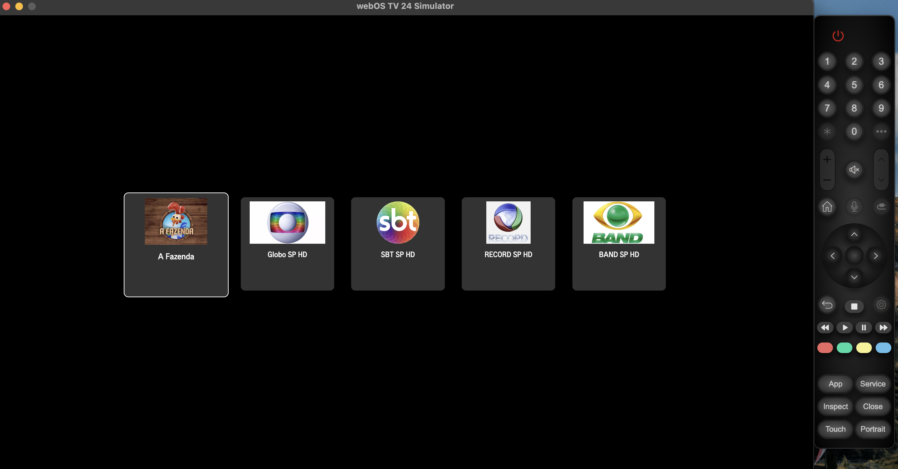

# IPTV Player Simples

## 📋 Descrição

Um aplicativo de IPTV simples desenvolvido para LG webOS com o intuito de facilitar o uso, especialmente para usuários com menos familiaridade com tecnologia. Este player foi projetado para abrir os canais diretamente, sem necessidade de navegação extensa, permitindo acesso rápido e fácil aos canais desejados.

## 🚀 Tecnologias Utilizadas

- **HTML5** e **CSS3**: para estrutura e estilos de layout.
- **JavaScript (ES6+)**: para interações e navegação entre os canais.
- **WebOS SDK**: integração e desenvolvimento para a plataforma LG TV.

## 📚 Documentação e Recursos LG

Para mais detalhes sobre o desenvolvimento para TVs LG webOS, consulte o link abaixo:

- [LG Developer](https://webostv.developer.lge.com/develop/getting-started)

## ℹ️ Instalação e Uso

Para instalar o aplicativo diretamente na sua TV LG, você pode seguir as etapas de instalação da LG para webOS usando o SDK e o ambiente de desenvolvimento local.
- [LG Developer Mode](https://webostv.developer.lge.com/develop/getting-started/developer-mode-app)

### 🚀 Configuração de Atalho para Acesso Rápido

Após instalar o app na sua TV LG, você pode configurar um atalho para abrir o Player com apenas um toque. Isso torna ainda mais fácil e rápido.

1. Configuração de Atalho na TV LG: Aprenda a configurar atalhos personalizados para seus aplicativos na TV, seguindo este guia da LG: [Como criar atalhos na TV LG](https://www.lg.com/br/suporte/suporte-ao-producto/solucionar-problemas/help-library/cs-CT20096005-20150870248439/?srsltid=AfmBOooC0bdIeNtVHCYH-LNNM7Fr7jtnHVrgtVh7Qd0DnGiAT3yfLckc).

2. Inicialização Rápida: Após configurar o atalho, ao ligar a TV, basta segurar a tecla de atalho que você escolheu, e o Player será aberto diretamente.

Essa funcionalidade economiza tempo e torna o acesso aos seus canais ainda mais prático!

## 🖼️ Capturas de Tela

## 🔗 Contribuição e Contato

Este projeto foi desenvolvido para simplificar a experiência de visualização de IPTV. Se tiver alguma dúvida ou sugestão, sinta-se à vontade para entrar em contato.

---

